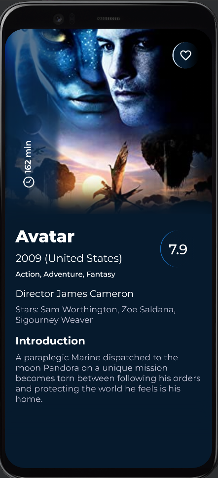
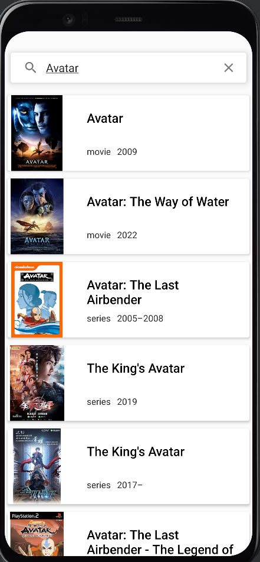

# omdbmovies
### This project shows my actual minimum skillset in android development (*I can do much more ;)* )

**Language**: Hybryd(Kotlin xml + Compose)

**App architecture**: MVVM + Clean Architecture

**Libraries**: Dagger Hilt, Retrofit, Picasso, Navigation Component(NavGraph)

**Api**: [OMDb API](https://www.omdbapi.com)

**Screenshots:**

* Movie details screen(Version 1) *

* Movie search screen(Version 1) *

*other screens in development, coming soon...*
